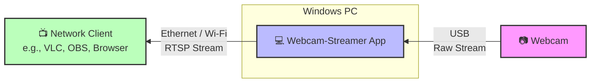

# webcam-streamer

Turn any webcam on your Windows PC into a RTSP streams and use any RTSP client on your network to watch.

`webcam_streamer` is a small Windows desktop app that can publish every USB
webcam attached to the PC as an RTSP stream (`rtsp://<HOST>:8554/webcam0`,
`/webcam1`, ...). Point VLC OR any other RTSP client at the URL and you get live video.

It is designed for monitoring use cases: leave a PC sitting next to some
hardware, plug in one or more webcams, start the app, and watch the cams
from anywhere on the LAN.

---

## Features

- **Plug-and-play**: cameras are auto-detected on startup and on hot-plug.
- **codec**: H.264
- **Per-camera overrides**: change resolution or framerate from the
  UI; settings persist across restarts.
- **Security**: RTSP digest auth used with random username + password

---

## Quick install (binary release)

1. Download the latest `WebcamStreamerSetup-vX.Y.Z.exe` from the
   [Releases page](../../releases).
2. Run the installer. It bundles everything — FFmpeg, MediaMTX, the .NET
   runtime — so no separate downloads are required and the installer works
   offline.
3. Launch **Webcam Streamer** from the Start menu.
4. Each detected camera appears as a row in the table. The RTSP URL is
   shown in the "Stream URL" column — copy it into VLC ("Media → Open
   Network Stream...") to view.

> First-run note: Windows SmartScreen may show "Windows protected your PC"
> because the installer is not code-signed. Click **More info → Run
> anyway**.

---

## Architecture

## Reporting bugs

Please use the [GitHub Issues](../../issues) tab. A useful bug report
includes:

- Windows version (`winver`)
- Output of `.\third_party\ffmpeg\ffmpeg.exe -version` (first 2 lines)
- The camera model(s) involved
- The relevant `probes\<slug>.summary.txt`
- Supervisor console output if you can capture it

For questions or general discussion, prefer
[GitHub Discussions](../../discussions) — keeps the Issues tab focused on
actual bugs.

---

## Security

This is a LAN-scoped tool. The default digest authentication does not protect against man-in-the-middle-attacks (MITM).
The RTSP stream is also not encrypted.
---

## License

`webcam_streamer` is released under the **GNU General Public License
v3.0** — see [LICENSE](LICENSE).

The project bundles third-party binaries (FFmpeg, MediaMTX) and a header-
only library (nlohmann/json), each under their own licenses. See
[THIRD_PARTY_NOTICES.md](THIRD_PARTY_NOTICES.md) for the full list and
source-availability information.

---

## Acknowledgements

- [FFmpeg](https://www.ffmpeg.org/) — the actual streaming engine.
- [MediaMTX](https://github.com/bluenviron/mediamtx) — the RTSP server.
- [gyan.dev](https://www.gyan.dev/ffmpeg/builds/) — Windows FFmpeg builds.
- [nlohmann/json](https://github.com/nlohmann/json) — the JSON parser
  used by the supervisor.
