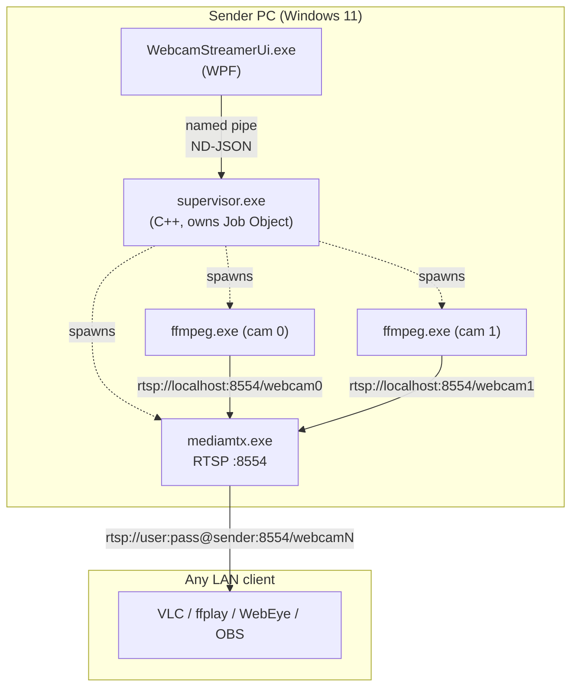

# webcam_streamer

> Turn the USB webcams on a Windows PC into RTSP streams that any client on
> your LAN can watch.

`webcam_streamer` is a small Windows desktop app that publishes every USB
webcam attached to the PC as an RTSP stream (`rtsp://host:8554/webcam0`,
`/webcam1`, ...). Point VLC, ffplay, the WebEye .NET control, OBS, or any
other RTSP client at the URL and you get live video.

It is designed for monitoring use cases: leave a PC sitting next to some
hardware, plug in one or more webcams, start the app, and watch the cams
from anywhere on the LAN.

---

## Features

- **Plug-and-play**: cameras are auto-detected on startup and on hot-plug.
- **Auto codec selection**: each camera is probed once and the best working
  pipeline is picked (MJPEG passthrough / H.264 transcode / etc.) — works
  around the surprising number of cams that violate RFC 2435 or have buggy
  MJPEG packetisation.
- **Per-camera overrides**: change mode, resolution, or framerate from the
  UI; settings persist across restarts.
- **Crash-safe**: a C++ supervisor owns FFmpeg + MediaMTX as child
  processes inside a Windows Job Object. Close the UI and every child
  process is killed cleanly — no orphaned `ffmpeg.exe` eating CPU.
- **Trusted-LAN out of the box**: RTSP basic auth enabled by default
  (`viewer:viewer` for read, `publisher:publisher` for write).
- **No audio, no recording**: monitoring is the only use case; the
  pipeline stays simple.

---

## Quick install (binary release)

1. Download the latest `WebcamStreamerSetup-vX.Y.Z.exe` from the
   [Releases page](../../releases).
2. Run the installer. It bundles everything — FFmpeg, MediaMTX, the .NET
   runtime — so no separate downloads are required and the installer works
   offline.
3. Launch **Webcam Streamer** from the Start menu.
4. Each detected camera appears as a row in the table. The RTSP URL is
   shown in the "Stream URL" column — copy it into VLC ("Media → Open
   Network Stream...") to view.

> First-run note: Windows SmartScreen may show "Windows protected your PC"
> because the installer is not code-signed. Click **More info → Run
> anyway**.

---

## Architecture



- **WPF UI** is just a presentation layer over the supervisor. It can be
  closed and re-opened without disturbing the streams (and a future
  Service mode is a drop-in replacement).
- **Supervisor** is the boss process. It enumerates cameras, picks codecs,
  starts MediaMTX + one FFmpeg per camera, restarts crashes with
  exponential backoff, and exposes a named-pipe IPC for the UI.
- **MediaMTX + FFmpeg** do all the actual streaming work. We don't write
  RTP packetisation, RTSP control flow, or H.264 framing ourselves —
  battle-tested upstream code does it.

---

## Build from source

### Prerequisites

- Windows 10 / 11 x64
- Visual Studio 2022 with the **Desktop C++** workload (for the supervisor)
- [.NET 9 SDK](https://dotnet.microsoft.com/download/dotnet/9.0) (for the
  WPF UI)
- PowerShell 7+

### Steps

```powershell
# 1. Download third-party binaries (idempotent; skips what's already there)
.\scripts\setup-deps.ps1

# 2. Build the supervisor (C++)
cd supervisor
cmake -S . -B build -G "Visual Studio 17 2022" -A x64
cmake --build build --config Release
cd ..
# → supervisor\build\Release\supervisor.exe

# 3. Build the WPF UI (debug build for local use)
dotnet build ui\WebcamStreamerUi -c Release
# → ui\WebcamStreamerUi\bin\Release\net9.0-windows\WebcamStreamerUi.exe

# 4. Run interactively
.\ui\WebcamStreamerUi\bin\Release\net9.0-windows\WebcamStreamerUi.exe
```

### Hardware verification

Once you have at least one webcam attached:

```powershell
# Probe every connected camera and write probes\<slug>.json + .summary.txt
Get-PnpDevice -Class Camera -Status OK | ForEach-Object {
    .\scripts\probe-camera.ps1 -CameraName $_.FriendlyName
}

# Run the end-to-end regression (drives supervisor + UI, validates teardown)
.\scripts\verify-end-to-end.ps1
```

---

## Building the installer

See [installer/README.md](installer/README.md). You need
[Inno Setup 6](https://jrsoftware.org/isdl.php) installed; the script
collects every artefact and produces `WebcamStreamerSetup-vX.Y.Z.exe`
under `installer/output/`.

---

## How it works under the hood

For implementation detail — the IPC protocol, the codec-probe state
machine, the surprisingly long list of FFmpeg / Windows gotchas we tripped
over — see [CLAUDE.md](CLAUDE.md). That file is the canonical engineering
reference for the project.

---

## Reporting bugs

Please use the [GitHub Issues](../../issues) tab. A useful bug report
includes:

- Windows version (`winver`)
- Output of `.\third_party\ffmpeg\ffmpeg.exe -version` (first 2 lines)
- The camera model(s) involved
- The relevant `probes\<slug>.summary.txt`
- Supervisor console output if you can capture it

For questions or general discussion, prefer
[GitHub Discussions](../../discussions) — keeps the Issues tab focused on
actual bugs.

---

## Security

This is a LAN-scoped tool. The default basic-auth credentials
(`viewer:viewer` / `publisher:publisher`) are *not* secure against a
hostile network — change them in `config/mediamtx.yml` if you expose the
host beyond a trusted LAN. Do not forward port 8554 to the public
internet without first switching to strong credentials and considering an
`rtsps://` proxy in front of MediaMTX.

To report a security issue privately, see [SECURITY.md](SECURITY.md).

---

## License

`webcam_streamer` is released under the **GNU General Public License
v3.0** — see [LICENSE](LICENSE).

The project bundles third-party binaries (FFmpeg, MediaMTX) and a header-
only library (nlohmann/json), each under their own licenses. See
[THIRD_PARTY_NOTICES.md](THIRD_PARTY_NOTICES.md) for the full list and
source-availability information.

---

## Acknowledgements

- [FFmpeg](https://www.ffmpeg.org/) — the actual streaming engine.
- [MediaMTX](https://github.com/bluenviron/mediamtx) — the RTSP server.
- [gyan.dev](https://www.gyan.dev/ffmpeg/builds/) — Windows FFmpeg builds.
- [nlohmann/json](https://github.com/nlohmann/json) — the JSON parser
  used by the supervisor.
